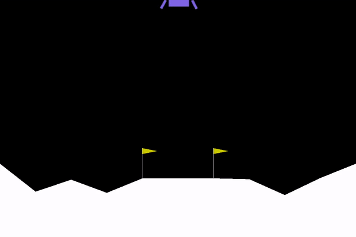

# Python RL

This repository serves as a home for my work and experiments on reinforcement learning algos.

# PPO 

## Lunar Lander
The ppo lunar lander is a tensorflow implemetation of the PPO algorithm.

The following are other implementations that helped me a lot with my own.

## Snake

Will upload soon

#### References:
    - https://github.com/nikhilbarhate99/PPO-PyTorch/blob/master/PPO.py
    - https://github.com/DavidCastilloAlvarado/PPO_reinforcement_learning/blob/master/PPO_pendulum.py
    - https://blog.varunajayasiri.com/ml/ppo_pytorch.html
    - (paper) https://arxiv.org/abs/1707.06347
    
    
# NEAT

Neat is an evolutionary algorithm that evolves neural networks.

(nothing here yet will upload in future)
    
